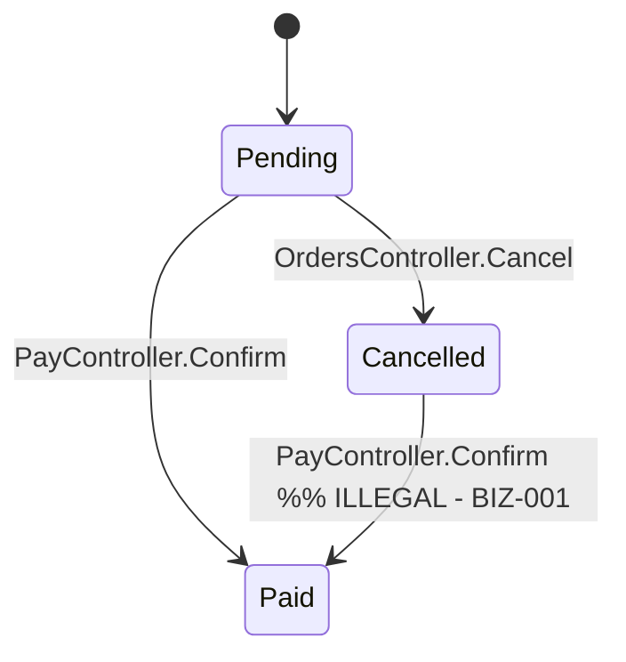
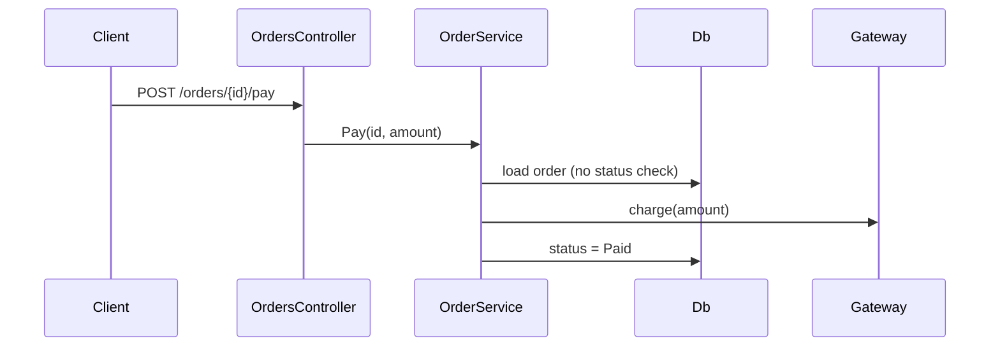

## Plugin invocation

When invoking a skill from this bundle, use `audit-app:<skill-name>`. Shared audit
utilities use `audit-core:<skill-name>`. Keep bare skill IDs in JSON, status files,
and output paths. Resolve `scripts/` and `references/` relative to this SKILL.md,
not the audited repository; quote script paths when running commands.


# Audit business logic

Static analysers find injection and leaks; they do not know that an order must
not go from Cancelled to Paid, that a 10% coupon must apply once, or that a
refund cannot exceed what was charged. This skill finds those defects by
reading the code the way a domain expert would: pick the flows that move money,
stock, or entitlements, draw how they really behave, and check each rule the
business relies on. The grep pass only points at where to look; the value is
in the manual trace.

Read-only rule: never modify the audited code. Write only under `audit/`.

## Inputs and prerequisites

- Path to the audited repository (or two paths when backend and frontend are separate repos).
- `audit/stack.json` if `audit-application` already ran; otherwise this skill runs `$AUDIT_CORE_ROOT/skills/audit-stack-detection/scripts/detect_stack.py`.
- Optional: a domain summary from the user (what the product sells, who approves what). Ask one question if the domain is unclear; otherwise infer it from entity names, routes, and enums.
- Python 3 for the bundled scripts.
- Skills from the `audit-core` plugin (reached via `$AUDIT_CORE_ROOT`, exported by that plugin; a sibling `skills/` layout also works): `audit-stack-detection` (stack detection), `audit-code-scan` (grep pass, and the shared `repo_walk.py` walker the bundled scripts import) and `audit-finding-writer` (`$AUDIT_CORE_ROOT/skills/audit-finding-writer/scripts/findings.py`). A missing one stops the scripts with an error naming it.

## Coordination with sibling skills

This skill owns rules; two siblings own the mechanics those rules depend on.
Hand off rather than duplicate:

| You notice while tracing | Hand to | What to pass |
|---|---|---|
| A cutoff, expiry, "today", billing period, or DST-sensitive date decision | `audit-datetime-and-timezone` | flow name, file:line, which zone the rule assumes |
| A check-then-act (stock check then decrement, uniqueness check then insert), a missing idempotency key on a payment/webhook, or a job that could run twice | `audit-concurrency-and-race-condition` | flow name, the two statements that race, the table involved |

Record every hand-off in `audit/reports/audit-business-logic.md` under "Handed off", and still record the *business* consequence here (for example "double decrement leaves stock negative") as a `likely` finding with `tags: ["handoff:race"]` so the rule is not lost if the sibling never runs.

## Workflow

1. **Resolve the stack.** Run `python "$AUDIT_CORE_ROOT/skills/audit-stack-detection/scripts/detect_stack.py" <repo>`. Open only the matching `references/<stack>.md` (backend) and, if a frontend is present, its `references/<frontend>.md` to know which client-side rules are cosmetic. Unknown stack: use `$AUDIT_CORE_ROOT/skills/audit-stack-detection/references/stack-reference-template.md` and say so in scope.
2. **Automated pass.** Run
   `python "$AUDIT_CORE_ROOT/skills/audit-code-scan/scripts/grep_scan.py" <repo> --patterns scripts/patterns/<stack>.json --out audit/evidence/audit-business-logic/hits.json --md audit/evidence/audit-business-logic/hits.md`.
   The patterns find money arithmetic on `float`/`double`, state-transition `switch`/`if` chains, discount application sites, rounding calls, and status assignments. Then run
   `python scripts/flow_inventory.py <repo> --out audit/evidence/audit-business-logic/flows.json` to list candidate flows (status enums, entities named order/payment/invoice/subscription/stock/approval, and the handlers that mutate them). Hits are pointers, not findings.
3. **Pick and trace the critical flows.** Use `references/flow-catalog.md`: it lists the common critical flows and the rules to verify for each. Choose every flow the app actually has (usually 4-8). For each flow, by hand:
   - Draw the state machine (Mermaid `stateDiagram-v2`) from the enum and every place that assigns the status. Mark each transition with the handler that performs it. A transition that exists in code but not in the diagram you would expect is a finding candidate.
   - Draw the sequence (Mermaid `sequenceDiagram`) for the happy path from the entry point (controller/route/job) through service to persistence and any external call.
   - Walk the rule checklist for that flow (`references/flow-catalog.md` plus `references/rule-checklist.md`) and record each rule as verified / violated / not traceable with the file:line where it is enforced.
   - Try the abuse cases: replay the request, skip a step by calling a later endpoint directly, call as admin/impersonated user, apply the same coupon twice, submit a negative quantity or zero price, pay a different amount than the total.
4. **Write findings** with `$AUDIT_CORE_ROOT/skills/audit-finding-writer/scripts/findings.py` (block below, prefix `BIZ`). Rate with `audit-finding-writer/references/severity-rubric.md`; money-moving flows move up one severity. Set `confidence: likely` when a rule could not be traced to enforcement.
5. **Produce the outputs.**
   - `audit/findings/audit-business-logic.json` (`$AUDIT_CORE_ROOT/skills/audit-finding-writer/scripts/findings.py init` then `add`; `md` renders the findings section).
   - `audit/reports/audit-business-logic.md` using the template below: per flow, the diagrams, the rules table, the findings; then the "Flows not fully traced" list.
   - `audit/evidence/audit-business-logic/` with `hits.json`, `flows.json`, and one `<flow>.mmd` per diagram.
   - `audit/status/audit-business-logic.json`: the status record defined in `audit-core:audit-finding-writer` (references/run-status.md).
6. **List what was not checked.** Flows you found but did not trace, rules that live outside the repo (payment provider config, stored procedures, feature flags), and everything handed to a sibling. Put them in `scope.not_checked` with a reason and in the report. Also list what the automated pass did not read: folders skipped by the shared walker (`repo_walk.SKIP_DIRS` in `audit-code-scan`: `.git`, `node_modules`, `bin`, `obj`, `dist`, `build`, `target`, `coverage`, `.angular`, `.next`, the `audit` workspace and similar) and files over 2 MB; `flow_inventory.py` also skips `migrations`/`Migrations` folders on purpose (generated schema code, not business rules).

## Finding format

Write findings using `audit-core:audit-finding-writer`, with ID prefix `BIZ`.
Use its canonical schema and severity rubric. Topic-specific field guidance:

- **Impact:** Plain language: who is affected, what they lose (money, stock, entitlement), how likely.
- **Remediation:** The concrete fix in this stack, with a short example.
- **Reference:** CWE-840 (business logic errors), CWE-841 (improper enforcement of behavioral workflow), CWE-682 (incorrect calculation), CWE-20, ASVS-11.1.x, or "none applicable" in tags.


## Output template (`audit/reports/audit-business-logic.md`)

```markdown
# Business logic audit

Target: <repo> @ <commit> | Stack: <backend>/<frontend> | Date: <ISO date>

## Summary
| Severity | Count |
|---|---|
| Critical | n | ... |

Flows traced: n of m identified. Handed off: k items (see below).

## Flow: <name>  (entry: <controller/route>, entities: <A, B>)

### State machine


### Sequence (happy path)


### Rules verified
| Rule | Status | Enforced at | Note |
|---|---|---|---|
| Only Pending/AwaitingPayment can become Paid | violated | - | BIZ-001 |
| Charged amount equals server-computed total | verified | OrderService.cs:88 | |
| Coupon applies at most once per order | violated | PricingService.cs:41 | BIZ-002 |

### Findings
<finding blocks for this flow>

## Handed off
| To | Item | Location |
|---|---|---|
| audit-concurrency-and-race-condition | stock check then decrement | StockService.cs:120 |

## Flows not fully traced
| Flow | Reason |
|---|---|
| Refund via provider webhook | handler calls a stored procedure not in repo |

## Not checked
- <item>: <reason>
```

## Examples

**Input:** `evals/files/sample-repo/src/orders/OrderService.cs` where `Pay()` loads the order and sets `Status = OrderStatus.Paid` without reading the current status.

**Output:**
```markdown
### [High] BIZ-001 - Pay() accepts orders in any status, including Cancelled
- **Location:** `src/orders/OrderService.cs:34` (Pay)
- **Confidence:** confirmed
- **Evidence:**

```csharp
var order = _repo.Get(id);
order.Status = OrderStatus.Paid;   // no guard on order.Status
```

- **Impact:** A cancelled order can be paid and shipped after stock was released and the customer told it was cancelled; support cannot reconcile it. Rated High because money moves and any authenticated customer can trigger it.
- **Remediation:** Centralise transitions: `if (!OrderStateMachine.CanTransition(order.Status, OrderStatus.Paid)) throw new InvalidTransitionException(...)` before charging; encode the allowed map once (`Pending -> Paid`, `Pending -> Cancelled`) and reuse it in every handler.
- **Reference:** CWE-841, ASVS-11.1.4
```

**Input:** `PricingService.ApplyDiscount` recalculates `order.Total -= coupon.Amount` each time it is called, and the checkout page calls it on every "update cart" request.

**Output:** `[High] BIZ-002 - Coupon discount is subtracted again on every cart update` with remediation "compute the total from line items plus a single `AppliedCouponId`; never mutate the stored total incrementally", reference CWE-682/CWE-840.

## Bundled files

- `references/flow-catalog.md` - common critical flows (payments, orders, subscriptions, inventory, approvals, permissions) with the rules to verify for each and the abuse cases to try.
- `references/rule-checklist.md` - cross-flow checklist: money, state, validation, admin/impersonation, replay/skip.
- `references/<stack>.md` - where the domain logic lives, money/state idioms, what to grep, false positives, per stack (dotnet, java-spring, node-express, python-django, angular, react, vue); add one from `$AUDIT_CORE_ROOT/skills/audit-stack-detection/references/stack-reference-template.md`.
- `$AUDIT_CORE_ROOT/skills/audit-stack-detection/scripts/detect_stack.py` - stack detection (honours `audit/stack.json`; atomic skill).
- `scripts/patterns/<stack>.json` - automated pass run by `$AUDIT_CORE_ROOT/skills/audit-code-scan/scripts/grep_scan.py`: float money, state switches, discount sites, rounding.
- `scripts/flow_inventory.py` - lists status enums, domain entities and their mutating handlers as candidate flows. Walks files with `audit-code-scan`'s `repo_walk.py`.
- `$AUDIT_CORE_ROOT/skills/audit-finding-writer/scripts/findings.py` - init / add / validate / md / summary for findings.json (atomic skill).
- `evals/` - sample repo with an order state machine that allows Cancelled -> Paid and a discount applied twice, plus correct negatives.
