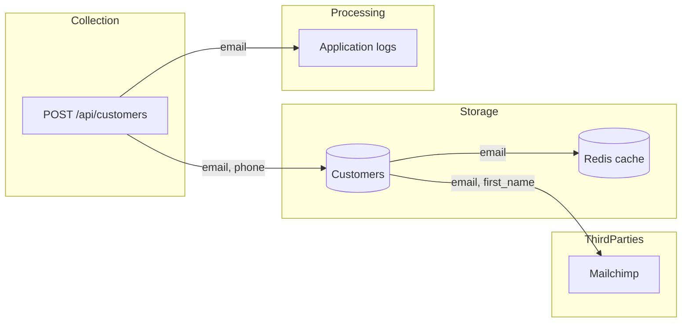

## Plugin invocation

When invoking a skill from this bundle, use `audit-app:<skill-name>`. Shared audit
utilities use `audit-core:<skill-name>`. Keep bare skill IDs in JSON, status files,
and output paths. Resolve `scripts/` and `references/` relative to this SKILL.md,
not the audited repository; quote script paths when running commands.


# Audit: privacy data-flow mapper

Answers "where does personal data go?" for a repository. It produces the
inventory that `audit-gdpr-data-protection` and `audit-soc2-controls-evidence`
consume (`audit/evidence/audit-privacy-data-flow-mapper/data-inventory.json`)
and a diagram a product owner can read. Its own findings are limited to what
the map itself proves (PII in a log, in a cache key, in a URL, sent to an
undeclared third party); the legal judgement belongs to the GDPR skill.

Read-only rule: never modify the audited code. Write only under `audit/`.

## Inputs and prerequisites

- Repo root (default `.`). Standalone runs read `audit/stack.json` if present,
  otherwise run `python "$AUDIT_CORE_ROOT/skills/audit-stack-detection/scripts/detect_stack.py" <repo>` (without `--write`).
- No tools beyond Python 3. Everything is static analysis; the map is only as
  good as the naming in the code, so the manual pass matters.
- Skills from the `audit-core` plugin (reached via `$AUDIT_CORE_ROOT`, exported by that plugin; a sibling `skills/` layout also works): `audit-stack-detection`,
  `audit-code-scan` (grep pass and the shared file walker `pii_scan.py` imports),
  `audit-sensitive-data-catalog` (which field names and values are personal data) and
  `audit-finding-writer` (findings I/O).
- Optional: schema exports (`*.sql`, EF migrations, Prisma/TypeORM schema,
  Django `models.py`) make the *storage* column much stronger; if the schema
  lives outside the repo, say so in *Not checked*.
- Optional: a list of known vendors from the team. Without it, third parties
  are identified from domains and SDK names via `references/third-party-catalog.md`.

## Workflow

1. **Resolve the stack.** `python "$AUDIT_CORE_ROOT/skills/audit-stack-detection/scripts/detect_stack.py" <repo>`; open only the
   matching `references/<stack>.md`. It tells you where models, DTOs, loggers,
   cache clients, analytics hooks, templates and HTTP clients live in that
   framework, and which grep hits are usually benign.
2. **Automated pass.**
   - `python scripts/pii_scan.py <repo> --out audit/evidence/audit-privacy-data-flow-mapper/data-inventory.json --md audit/evidence/audit-privacy-data-flow-mapper/inventory.md --mermaid audit/evidence/audit-privacy-data-flow-mapper/data-flow.mmd`
     finds PII by field name and by value (both classified by
     `audit-sensitive-data-catalog`), classifies each field, tags
     every occurrence with its sink (`model`, `schema`, `dto`, `collection`,
     `log`, `cache`, `analytics`, `template`, `outbound`, `messaging`, `url`),
     resolves outbound calls to a third party from `references/third-party-catalog.md`,
     and writes the inventory, the table and the diagram.
   - `python "$AUDIT_CORE_ROOT/skills/audit-code-scan/scripts/grep_scan.py" <repo> --patterns scripts/patterns/<stack>.json --out audit/evidence/audit-privacy-data-flow-mapper/hits.json`
     adds framework-specific sinks the generic scanner cannot name (Serilog
     destructuring, `@Slf4j` MDC, Django `logger.info(f"...")`, Angular
     analytics services, React `gtag`, etc.).
   Read `data-inventory.json.not_checked` first: it lists file types skipped,
   schema sources not found, and unresolved outbound hosts.
3. **Manual trace of the highest-risk flows.** In priority order:
   - Every `outbound` / `messaging` / `analytics` occurrence: open the call, find
     the payload builder, list the exact fields sent and the vendor. Add the
     vendor to `third_parties` with a purpose (marketing, support, payments,
     analytics, error tracking, SMS, email) and whether a DPA is known (usually
     "unknown - organisational").
   - Every `log` occurrence: is the value the PII itself or an id? Structured
     logging with `{Email}` still ships the value.
   - Every `cache` occurrence: is PII in the *key* (visible in Redis `KEYS`,
     monitoring, and logs) or only in the value?
   - `url`: PII in path or query string ends up in access logs, proxies, browser history.
   - Collection points with no matching storage (data collected but never
     modelled - usually sent straight to a vendor) and storage with no collection
     point (imported data; ask where it came from).
   - Backups, exports, reports, file uploads (`wwwroot/uploads`, S3, Drive):
     these are storage locations the scanner only sees when named.
   Use the "Manual trace checklist" in the stack file.
4. **Write findings** with `python "$AUDIT_CORE_ROOT/skills/audit-finding-writer/scripts/findings.py"` (prefix `PII`). One finding per
   root cause: "email logged in N places" is one finding with all locations in
   Evidence. Severity per `audit-finding-writer/references/severity-rubric.md`:
   PII in logs shipped to a third party is High; PII in cache keys is Medium;
   special-category data anywhere outside the model is High; an undeclared
   third party receiving contact data is Medium until the GDPR skill decides.
5. **Emit outputs** (relative to the audited repo):
   - `audit/evidence/audit-privacy-data-flow-mapper/data-inventory.json` (schema in
     `references/data-inventory-schema.md`), `inventory.md`, `data-flow.mmd`, `hits.json`
   - `audit/findings/audit-privacy-data-flow-mapper.json`
   - `audit/reports/audit-privacy-data-flow-mapper.md` (template below)
   - `audit/status/audit-privacy-data-flow-mapper.json` -
     `{"skill": "...", "status": "completed|failed|skipped", "reason": "...", "started_at": "...", "finished_at": "..."}`
6. **Not checked.** Copy `data-inventory.json.not_checked` into `scope.not_checked`
   and add: schema outside the repo, binary/compiled templates, vendors whose
   payloads are built dynamically, retention (only code-visible jobs/TTLs are
   recorded; policy retention is organisational), and anything you did not open.

## Finding format

Write findings using `audit-core:audit-finding-writer`, with ID prefix `PII`.
Use its canonical schema and severity rubric. Topic-specific field guidance:

- **Evidence:**

```lang
<the exact line(s); for multi-location findings, one line per location>
```

- **Impact:** Plain language. Which personal data, where it ends up, who can see it there, how many people are affected.
- **Remediation:** Concrete fix in this stack: log the id not the value, hash the cache key, move the field to the request body, add the vendor to the processor list and gate the call behind consent.
- **Reference:** GDPR-Art.5(1)(c), GDPR-Art.32, CWE-532, CWE-359, ASVS-8.3.x, SOC2-C1.1


Same content goes to `findings.json`; put the field name(s) in `tags`, and set
`root_cause_key` = `pii:<field>:<sink>` (e.g. `pii:email:log`).

## Output template (`audit/reports/audit-privacy-data-flow-mapper.md`)

```markdown
## audit-privacy-data-flow-mapper

**Target:** <repo> @ <commit> - **Run:** <date> - **Stack:** dotnet + angular

| Critical | High | Medium | Low | Info |
|---|---|---|---|---|
| n | n | n | n | n |

### Personal-data inventory

| Field | Classification | Storage locations | Processors (in-code) | Third parties | Retention |
|---|---|---|---|---|---|
| email | contact | table Customers (Customer.cs:12) | log (CustomerService.cs:31), cache key (CustomerService.cs:40) | Mailchimp - marketing (CustomerService.cs:52) | unknown - no purge job found |
| phone | contact | table Customers | sms template (Templates/Otp.txt) | Twilio - SMS | unknown |

### Third parties / processors

| Vendor | Category | Fields sent | Where | DPA known? |
|---|---|---|---|---|
| Mailchimp | marketing | email, first_name | CustomerService.cs:52 | unknown - organisational |

### Data-flow diagram



### Findings
<finding blocks, most severe first>

### Not checked
- <item> - <reason>
```

## Examples

**Input (pii_scan occurrence):**
`{"field": "email", "sink": "log", "file": "Services/CustomerService.cs", "line": 31, "snippet": "_logger.LogInformation(\"Customer {Email} registered\", customer.Email);"}`

**Output:**
```markdown
### [High] PII-001 - Customer email written to application logs
- **Location:** `Services/CustomerService.cs:31` (Register)
- **Confidence:** confirmed
- **Evidence:**

```csharp
_logger.LogInformation("Customer {Email} registered", customer.Email);
```

- **Impact:** Every registration writes the customer's email to the log stream, which Serilog ships to the SQL log sink and is readable by anyone with log access; logs are kept indefinitely and are outside the deletion path, so erasure requests cannot be honoured. Rated High because the sink is shared and long-lived.
- **Remediation:** Log the customer id instead (`_logger.LogInformation("Customer {CustomerId} registered", customer.Id)`), or register a Serilog destructuring policy that masks `Email`; add a log retention limit.
- **Reference:** GDPR-Art.5(1)(c), GDPR-Art.5(1)(e), CWE-532, ASVS-8.3.5
```

**Input (outbound occurrence with vendor resolved):**
`{"field": "email", "sink": "outbound", "third_party": "Mailchimp", "file": "Services/CustomerService.cs", "line": 52}`

**Output:** an inventory row and a diagram edge, plus a Medium finding
`PII-002 - Customer email sent to Mailchimp with no consent check in the call path`
(confidence: likely, until the GDPR skill traces consent).

## Bundled files

- `references/pii-classification.md` - the classes the scanner emits and how catalog
  categories map to them, what counts as special category, how to classify ambiguous names.
- `references/third-party-catalog.md` - vendor domains and SDK identifiers
  mapped to name, category and typical data sent; `third-party-catalog.json` is the
  machine-readable form `pii_scan.py` loads.
- `references/data-inventory-schema.md` - shape of `data-inventory.json` and how
  the GDPR and SOC 2 skills read it.
- `references/<stack>.md` - dotnet, java-spring, node-express, python-django,
  angular, react, vue; to add a stack, copy `$AUDIT_CORE_ROOT/skills/audit-stack-detection/references/stack-reference-template.md`.
- `scripts/pii_scan.py` - the scanner (inventory JSON, Markdown table, Mermaid). Walks files with
  `audit-code-scan`'s `repo_walk` and classifies names and values with `audit-sensitive-data-catalog`.
- `scripts/patterns/<stack>.json` - framework-specific sinks, run with `$AUDIT_CORE_ROOT/skills/audit-code-scan/scripts/grep_scan.py`.
- Atomic scripts called: `$AUDIT_CORE_ROOT/skills/audit-stack-detection/scripts/detect_stack.py`,
  `$AUDIT_CORE_ROOT/skills/audit-code-scan/scripts/grep_scan.py`, `$AUDIT_CORE_ROOT/skills/audit-finding-writer/scripts/findings.py`;
  imported: `$AUDIT_CORE_ROOT/skills/audit-code-scan/scripts/repo_walk.py`, `$AUDIT_CORE_ROOT/skills/audit-sensitive-data-catalog/scripts/catalog.py`.
- `evals/` - prompts and a fixture where one email field reaches a table, a log
  line, a cache key and a marketing API call.
