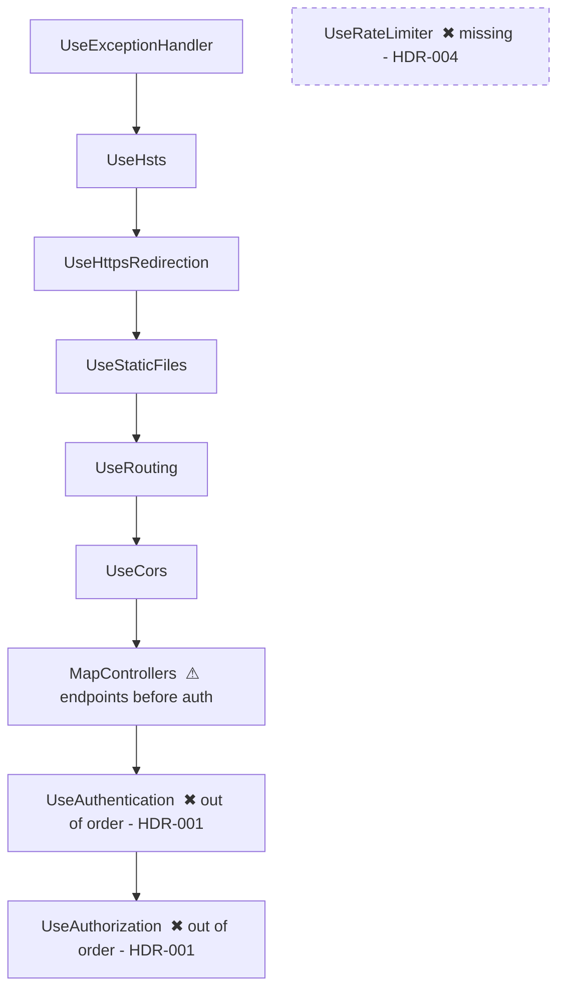

## Plugin invocation

When invoking a skill from this bundle, use `audit-app:<skill-name>`. Shared audit
utilities use `audit-core:<skill-name>`. Keep bare skill IDs in JSON, status files,
and output paths. Resolve `scripts/` and `references/` relative to this SKILL.md,
not the audited repository; quote script paths when running commands.


# Audit: security headers and middleware

Most of a web app's transport-level defences live in one file: the pipeline.
A header that is never set, a `UseAuthentication` placed after the endpoints,
a CORS policy that allows everything with credentials, or a cookie without
`HttpOnly` are each a one-line mistake with an app-wide effect. This skill
reads that file (and the config it depends on) for the stack, extracts the
middleware order as data, grades the headers the code would emit, and - only
when the user gives a URL - checks the live response too.

Read-only rule: never edit the audited code. Write only under `audit/`
(`findings`, `reports`, `evidence`, `status`). The live check sends plain GET
requests to the URL the user supplied and nothing else.

## Inputs and prerequisites

- Path to the repository root (backend, frontend hosting config, or both -
  SPAs get their headers from the host: nginx, `firebase.json`, `_headers`,
  `staticwebapp.config.json`, `vercel.json`; the frontend references cover them).
- `audit/stack.json` if `audit-application` already ran; otherwise run
  `$AUDIT_CORE_ROOT/skills/audit-stack-detection/scripts/detect_stack.py`.
- Python 3 (stdlib only) for the bundled scripts.
- Skills from the `audit-core` plugin (reached via `$AUDIT_CORE_ROOT`, exported by that plugin; a sibling `skills/` layout also works): `audit-stack-detection` (stack), `audit-code-scan` (grep pass and the shared file walker `extract_middleware.py` imports), `audit-finding-writer` (findings.json), `audit-sensitive-data-catalog` (decides which cookie names `check_headers.py` grades as auth-like).
- Optional: a URL (`https://staging.example.com`) for the live header check.
  Do not probe production or any host the user did not name; ask for the URL
  rather than guessing one from config.
- Optional: knowledge of the auth model (bearer token vs cookie) - it decides
  whether CSRF protection is required. `audit-client-auth-and-storage` reports
  it if it ran; otherwise read the auth setup in the pipeline file.

## Workflow

1. **Resolve the stack.** `python "$AUDIT_CORE_ROOT/skills/audit-stack-detection/scripts/detect_stack.py" <repo>`. Open only
   the matching `references/<stack>.md` (`dotnet`, `java-spring`,
   `node-express`, `python-django`; `angular`, `react`, `vue` for hosting
   configs and CSP compatibility of the SPA). A gateway (Ocelot/YARP/nginx) in
   front means two pipelines: audit both and say which one the browser sees.
   No match: use `$AUDIT_CORE_ROOT/skills/audit-stack-detection/references/stack-reference-template.md` and say so in scope.
2. **Automated pass.**
   - `python scripts/extract_middleware.py <repo> --stack <stack> --out audit/evidence/audit-security-headers-and-middleware/middleware.json --md audit/evidence/audit-security-headers-and-middleware/middleware.md`
     finds the pipeline file(s), lists the registrations in source order,
     compares against the expected order in `references/headers-checklist.md`,
     and prints a Mermaid diagram with out-of-order and missing stages marked.
   - `python "$AUDIT_CORE_ROOT/skills/audit-code-scan/scripts/grep_scan.py" <repo> --patterns scripts/patterns/<stack>.json --out audit/evidence/audit-security-headers-and-middleware/hits-<stack>.json --md audit/evidence/audit-security-headers-and-middleware/hits-<stack>.md`
     finds header middleware, cookie options, CORS policies, anti-forgery
     setup, rate limiters, body-size limits, and the dangerous variants
     (`AllowAnyOrigin` + credentials, `HttpOnly = false`, `unsafe-inline`).
   - Only when the user supplied a URL:
     `python scripts/check_headers.py <url> --out audit/evidence/audit-security-headers-and-middleware/live-headers.json --md audit/evidence/audit-security-headers-and-middleware/live-headers.md`
     (add `--header "Authorization: Bearer ..."` for an authenticated page, `--path /api/health` for extra paths). It grades each header pass / missing / misconfigured and each `Set-Cookie` flag.
3. **Manual trace of the highest-risk flows.** Open the pipeline file and the
   config it reads (`appsettings*.json`, `application.yml`, `settings.py`,
   `.env`, nginx/host config) and confirm: (a) the order the extractor found
   is the order at runtime (conditional registrations, `if (env.IsDevelopment())`
   branches, multiple `Startup` classes, gateway vs service); (b) which
   headers are actually emitted in production - by code, by the host, or by
   a CDN - and their values (a CSP with `'unsafe-inline' 'unsafe-eval'` and
   `*` is "misconfigured", not "present"); (c) the auth model: if any cookie
   carries a session or token, CSRF protection must exist (anti-forgery
   tokens, `SameSite=Strict/Lax` plus origin checks, double-submit) and be
   applied to every state-changing route; (d) rate limiting on login,
   password reset, OTP/SMS, registration, export/report endpoints - and that
   it keys on something the attacker cannot rotate for free; (e) body size
   limits on JSON and multipart (`MaxRequestBodySize`, `express.json({limit})`,
   `spring.servlet.multipart.max-file-size`, `DATA_UPLOAD_MAX_MEMORY_SIZE`);
   (f) every `Set-Cookie` site: `HttpOnly`, `Secure`, `SameSite`, `Path`,
   expiry; (g) CORS: explicit origin list, no credentials with wildcard or
   reflected origin, preflight cache reasonable; (h) error handling first in
   the pipeline and no stack traces in production responses.
4. **Write findings** with `$AUDIT_CORE_ROOT/skills/audit-finding-writer/scripts/findings.py`, id prefix `HDR`. One
   finding per root cause (one missing CSP is one finding, not one per
   page). Severity via `audit-finding-writer/references/severity-rubric.md`:
   auth registered after endpoints (routes run unauthenticated) is Critical;
   session cookie without `HttpOnly`/`Secure`, CORS credentials from any
   origin, cookie auth with no CSRF defence are High; no rate limit on login,
   no HSTS, missing CSP on an app with user-generated HTML are Medium;
   missing `X-Content-Type-Options`/`Referrer-Policy`/`Permissions-Policy`,
   `Server`/`X-Powered-By` disclosure are Low; documented deviations are Info.
5. **Produce the outputs** (paths relative to the audited repo):
   - `audit/findings/audit-security-headers-and-middleware.json`
   - `audit/reports/audit-security-headers-and-middleware.md` (skeleton below)
   - `audit/evidence/audit-security-headers-and-middleware/middleware.json|md`, `hits-<stack>.json|md`, `live-headers.json|md` (if a URL was given)
   - `audit/status/audit-security-headers-and-middleware.json`:
     the status record defined in `audit-core:audit-finding-writer` (references/run-status.md)
6. **List what was not checked**: no URL supplied (live headers unverified),
   CDN/WAF/load-balancer configuration outside the repo, headers on
   authenticated pages if only anonymous ones were fetched, gateway config
   not in the repo, WebSocket/SignalR endpoints, mobile WebView headers.
   Also list the automated pass's coverage limits from `audit-code-scan`: folders on the shared skip list (`node_modules`, `bin`, `obj`, `dist`, `build`, `.git`, `audit`, ... - see `$AUDIT_CORE_ROOT/skills/audit-code-scan/references/repo-walk-api.md`) and files over 2 MB are not read, and patterns match one line at a time. `extract_middleware.py` finds pipeline files
   with the same walker, so a `Program.cs` or `settings.py` under a skipped folder is not
   extracted - pass it with `--file`. `check_headers.py` grades a cookie as auth-like only
   when the catalog classifies its name as a credential or secret; a cookie named after
   metadata (`session_timeout`, `auth_expiry`) is graded as an ordinary cookie.

## Finding format

Write findings using `audit-core:audit-finding-writer`, with ID prefix `HDR`.
Use its canonical schema and severity rubric. Topic-specific field guidance:

- **Confidence:** confirmed | likely | false-positive

- **Impact:** Plain language. Who is affected, what they lose, how likely. One or two sentences, ending with the severity justification.
- **Reference:** CWE-nnn, ASVS-x.y.z, OWASP-A0n:2021


JSON fields: `id`, `title`, `severity`, `confidence`, `location`, `evidence`,
`impact`, `remediation`, `references`, `tags` (area: `headers`, `order`,
`csrf`, `cors`, `ratelimit`, `bodylimit`, `cookies`, `errors`). Full schema
and prefix table: `audit-finding-writer/references/findings-schema.md`.

## Output template - `audit/reports/audit-security-headers-and-middleware.md`

```markdown
## audit-security-headers-and-middleware findings

| Critical | High | Medium | Low | Info |
|---|---|---|---|---|
| n | n | n | n | n |

### Scope
- Stack: dotnet (WebHost gateway + Account/Product services), angular (hosted by nginx - nginx.conf)
- Pipeline files: WebHost/Program.cs, Account.MicroAPI/Program.cs, Product.MicroAPI/Program.cs
- Auth model: bearer JWT in Authorization header (no auth cookies) -> CSRF not required for API; anti-forgery still needed on Razor login page
- Live check: https://staging.example.com (yes/no - reason)

### Header checklist
| Header | Expected | Source (code) | Live value | Status | Finding |
|---|---|---|---|---|---|
| Content-Security-Policy | default-src 'self'; ... frame-ancestors 'none' | not set | absent | missing | HDR-002 |
| Strict-Transport-Security | max-age>=15552000; includeSubDomains | `app.UseHsts()` Program.cs:31 | max-age=2592000 | misconfigured (max-age too low) | HDR-005 |
| X-Content-Type-Options | nosniff | header middleware Program.cs:40 | nosniff | pass | - |
| X-Frame-Options | DENY or SAMEORIGIN (or CSP frame-ancestors) | ... | ... | ... | ... |
| Referrer-Policy | strict-origin-when-cross-origin or stricter | ... | ... | ... | ... |
| Permissions-Policy | camera=(), microphone=(), geolocation=() ... | ... | ... | ... | ... |
| Server / X-Powered-By | absent | ... | ... | ... | ... |

### Cookie flags
| Cookie | Set at | HttpOnly | Secure | SameSite | Path/Expiry | Status | Finding |
|---|---|---|---|---|---|---|---|
| refresh_token | AuthController.cs:88 | no | yes | none | / , 30d | misconfigured | HDR-003 |

### Middleware order

Expected: exception -> HSTS -> HTTPS redirect -> static files -> routing -> CORS -> authentication -> authorization -> rate limiting -> endpoints.

### CSRF, CORS, rate limiting, body limits
| Control | Required? | Present | Where | Status | Finding |
|---|---|---|---|---|---|
| Anti-forgery on cookie auth | no (bearer API) / yes (Razor pages) | ... | ... | ... | ... |
| CORS origin allow-list | yes | `AllowAnyOrigin()` | Program.cs:22 | misconfigured | HDR-006 |
| Rate limit on /auth/login | yes | none | - | missing | HDR-004 |
| Body size limit | yes | Kestrel default 30 MB | - | pass (note) | - |

### Findings
<one block per finding, Critical first>

### Not checked
- <item> - <reason>
```

## Examples

**Input (extractor output):** `Account.MicroAPI/Program.cs: order = [UseExceptionHandler, UseHttpsRedirection, UseRouting, UseCors, MapControllers, UseAuthentication, UseAuthorization]`

**Output:**
```markdown
### [Critical] HDR-001 - Authentication and authorization middleware registered after the endpoints
- **Location:** `Account.MicroAPI/Program.cs:44` (app.UseAuthentication)
- **Confidence:** confirmed
- **Evidence:**

```csharp
app.MapControllers();          // line 42 - endpoints execute here
app.UseAuthentication();       // line 44 - never reached for matched routes
app.UseAuthorization();        // line 45
```

- **Impact:** Every controller action runs before the JWT is validated, so `[Authorize]` attributes throw or are skipped and unauthenticated callers reach tenant data. Rated Critical: reachable by anyone, affects every endpoint.
- **Remediation:** Move `app.UseAuthentication(); app.UseAuthorization();` between `app.UseCors()` and `app.MapControllers()` (after `UseRouting`, before endpoints), and add a startup test that requests a protected route without a token and expects 401.
- **Reference:** CWE-306, ASVS-1.4.4, OWASP-A07:2021
```

**Input (grep hit):** `Account.MicroAPI/Controllers/AuthController.cs:88: Response.Cookies.Append("refresh_token", token, new CookieOptions { Secure = true, Expires = DateTime.UtcNow.AddDays(30) });`

**Output:** a **High** finding tagged `cookies`: refresh cookie readable by
script (`HttpOnly` defaults to false in `CookieOptions`) and with no
`SameSite`; remediation `new CookieOptions { HttpOnly = true, Secure = true, SameSite = SameSiteMode.Strict, Path = "/api/auth/refresh" }`; CWE-1004, ASVS-3.4.2.

## Bundled files

- `references/headers-checklist.md` - expected header values and grading rules, cookie flag rules, expected middleware order per stack, CSRF decision table, rate-limit and body-limit targets, severity anchors.
- `references/<stack>.md` - pipeline file locations, header/cookie/CORS/CSRF/rate-limit APIs, good configuration, trace checklist, false positives, tooling (`dotnet`, `java-spring`, `node-express`, `python-django`; `angular`, `react`, `vue` for SPA hosting configs and CSP compatibility). To add a stack, follow `$AUDIT_CORE_ROOT/skills/audit-stack-detection/references/stack-reference-template.md`.
- `scripts/extract_middleware.py` - per-stack middleware order extraction, expected-order comparison, Mermaid diagram with issues marked; finds pipeline files with `$AUDIT_CORE_ROOT/skills/audit-code-scan/scripts/repo_walk.py`.
- `scripts/check_headers.py` - live header and cookie-flag grader (urllib, stdlib only; runs only against a URL the user supplies); auth-like cookie names come from `$AUDIT_CORE_ROOT/skills/audit-sensitive-data-catalog/scripts/catalog.py`.
- `scripts/patterns/<stack>.json` - pattern lists for the automated pass (format: `$AUDIT_CORE_ROOT/skills/audit-code-scan/references/pattern-file-format.md`).

Atomic scripts this skill calls (installed next to it, not bundled):

- `$AUDIT_CORE_ROOT/skills/audit-stack-detection/scripts/detect_stack.py` - stack detection (honours `audit/stack.json`).
- `$AUDIT_CORE_ROOT/skills/audit-code-scan/scripts/grep_scan.py` - pattern-driven automated pass.
- `$AUDIT_CORE_ROOT/skills/audit-code-scan/scripts/repo_walk.py` - shared walker imported by `extract_middleware.py`.
- `$AUDIT_CORE_ROOT/skills/audit-sensitive-data-catalog/scripts/catalog.py` - cookie-name classification imported by `check_headers.py`.
- `$AUDIT_CORE_ROOT/skills/audit-finding-writer/scripts/findings.py` - init / add / validate / md / summary for findings.json.
- `evals/` - prompts, a .NET fixture (auth after endpoints, no CSP, cookie without HttpOnly), and expectations.
