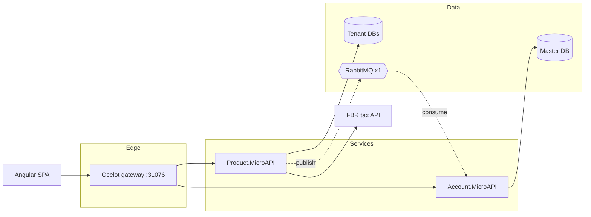
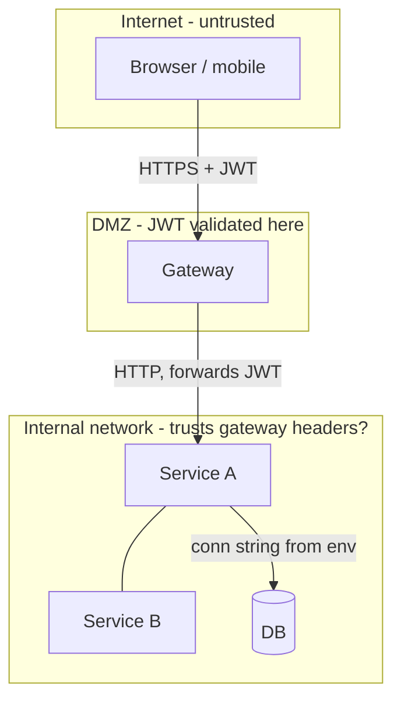

## Plugin invocation

When invoking a skill from this bundle, use `audit-app:<skill-name>`. Shared audit
utilities use `audit-core:<skill-name>`. Keep bare skill IDs in JSON, status files,
and output paths. Resolve `scripts/` and `references/` relative to this SKILL.md,
not the audited repository; quote script paths when running commands.


# Audit: system design

Reviews the architecture the repository actually has - the modules that
reference each other, the databases and queues in the compose file, the places
where authentication is enforced - and compares it with the architecture the
team believes it has. The code-level detail belongs to sibling skills; this one
answers "will this structure survive the next year of growth and the next
outage".

Read-only rule: never modify the audited code or docs. Write only under `audit/`.

## Inputs and prerequisites

- Repository root(s). Multi-repo systems (separate backend/frontend) are
  audited together: pass both roots and treat the cross-repo edge as an
  integration.
- Whatever design documentation exists: `README*`, `docs/`, `adr/`,
  `docs/adr`, `docs/decisions`, `architecture/`, `*.puml`, `*.drawio`, Mermaid
  blocks, wiki exports the user pastes. No docs is itself a finding (Info).
- Deployment descriptors if present: `docker-compose*.yml`, `k8s/`, `helm/`,
  `*.tf`, `Dockerfile`, CI workflows. Mechanics of deployment are delegated;
  they are read here only to discover components and replica counts.
- Optional context from the user: expected scale (users, requests/day, data
  size), team size, and the intended target (monolith, modular monolith,
  microservices). Ask once if absent; otherwise assume "small team, one
  region, growth 5x in 12 months" and state the assumption in the report.
- `audit/stack.json` if `audit-application` already ran; otherwise
  `$AUDIT_CORE_ROOT/skills/audit-stack-detection/scripts/detect_stack.py`. Python 3 stdlib only.
- Skills from the `audit-core` plugin (reached via `$AUDIT_CORE_ROOT`, exported by that plugin; a sibling `skills/` layout also works): `audit-stack-detection` (stack detection), `audit-code-scan` (grep pass, and the shared `repo_walk.py` walker the bundled scripts import) and `audit-finding-writer` (`$AUDIT_CORE_ROOT/skills/audit-finding-writer/scripts/findings.py`). A missing one stops the scripts with an error naming it.

## Delegations (state them in the report)

| Topic | Delegate to | This skill keeps |
|---|---|---|
| Endpoint shapes, versioning, error contracts, pagination | `audit-api-contract` | which components call which, sync vs async |
| Capacity, N+1, caching effectiveness, load numbers | `audit-performance-and-scalability` | structural scalability limits (state in process, single writer, shared DB) |
| Container/K8s/IaC hygiene, secrets injection, rollout mechanics | `audit-infra-and-deployment` | topology: replicas, SPOFs, trust boundaries |
| Tenant filters in queries | `audit-multi-tenant-isolation` | where tenancy is decided architecturally (static holder, per-request DB) |
| Authz per endpoint | `audit-authz-and-access-control` | where authn/authz is enforced (gateway vs service) |

## Workflow

1. **Resolve the stack.** `python "$AUDIT_CORE_ROOT/skills/audit-stack-detection/scripts/detect_stack.py" <repo>`; open only
   `references/<stack>.md` for each detected backend and frontend. Unknown
   stack: `$AUDIT_CORE_ROOT/skills/audit-stack-detection/references/stack-reference-template.md`, say so in `scope.not_checked`.
2. **Automated pass** (all outputs under `audit/evidence/audit-system-design/`):
   - `python scripts/module_graph.py <repo> --out modules.json --md modules.md --mermaid modules.mmd`
     builds the module dependency graph (csproj `ProjectReference`, Maven/Gradle
     modules, package.json workspaces + TypeScript import graph, Django apps),
     detects circular references, reports fan-in/fan-out/instability per module
     and layer-direction violations.
   - `python scripts/data_ownership.py <repo> --out ownership.json --md ownership.md`
     maps which module writes which table/entity and flags tables with more
     than one writer (shared database, dual writes).
   - `python scripts/topology_scan.py <repo> --out topology.json --md topology.md`
     lists infrastructure components (databases, queues, caches, gateways) from
     compose/k8s/config, their replica counts and dependents, and flags
     single-instance components that every flow depends on.
   - `python scripts/doc_drift.py <repo> --modules modules.json --topology topology.json --out drift.json --md drift.md`
     extracts component names from README/ADR/diagram files and reports what
     is documented but absent, present but undocumented, and lists ADRs with
     their decision statements for manual verification.
   - `python "$AUDIT_CORE_ROOT/skills/audit-code-scan/scripts/grep_scan.py" <repo> --patterns scripts/patterns/<stack>.json --out hits.json`
     for design smells in code: static mutable state, in-process caches and
     sessions, `new HttpClient()`, missing timeouts/retries, direct DbContext
     use in controllers, god classes, sync-over-async, direct queue publish
     without outbox.
   All hits are candidates; confirm each in the source.
3. **Manual trace of the highest-risk flows** (order matters):
   1. The money or core-business flow end to end (request -> gateway -> service
      -> DB -> queue -> consumer -> external API). Draw it; every hop is a
      component or an edge in the diagram.
   2. Every table with more than one writer: who owns it, is there a
      transaction across services, what happens on partial failure.
   3. Every single-instance infrastructure component: what stops when it is
      down, is there a retry/backoff/circuit breaker on the callers, is the
      consumer idempotent, is there a dead-letter path.
   4. Where identity is established and where it is trusted: gateway checks
      JWT then forwards? Do downstream services re-validate? Can a service be
      reached bypassing the gateway? Where do secrets enter (env, vault, file)?
   5. Process state: in-memory caches, static holders, sessions, SignalR/
      websocket without backplane, local file uploads - anything that breaks
      with two instances.
   6. Documented decisions vs code (ADR drift list from step 2).
   7. Fit for purpose: count services, queues, databases and layers against
      the stated scale and team size; note over- and under-engineering.
4. **Write findings** with `$AUDIT_CORE_ROOT/skills/audit-finding-writer/scripts/findings.py` (prefix `ARCH-`). One root
   cause per finding; a circular reference between two modules is one finding
   with both locations. Severity follows the rubric in
   `$AUDIT_CORE_ROOT/skills/audit-finding-writer/references/severity-rubric.md`, read as production
   risk: SPOF on the critical path = High (Critical if there is no recovery
   procedure and the flow moves money), shared table with two writers = High,
   circular module reference = Medium (High if it crosses a service boundary),
   README drift = Low/Info unless it misleads on-call staff about a real
   dependency.
5. **Produce the outputs** at the fixed paths:
   - `audit/findings/audit-system-design.json`
   - `audit/reports/audit-system-design.md` (template below: discovered-
     architecture diagram, trust-boundary diagram, coupling table, ADR-drift
     list, findings, 12-month design risks, delegations, not checked)
   - `audit/evidence/audit-system-design/` (all script outputs, `.mmd` diagrams)
   - `audit/status/audit-system-design.json`:
     the status record defined in `audit-core:audit-finding-writer` (references/run-status.md)
6. **List what was not checked** and why: runtime topology you could not see
   (cloud console, managed queue replication settings), traffic numbers,
   third-party SLAs, anything only visible at runtime, and every delegated
   topic with the sibling skill's name. Also list what the automated pass did not read: folders skipped by the shared walker (`repo_walk.SKIP_DIRS` in `audit-code-scan`: `.git`, `node_modules`, `bin`, `obj`, `dist`, `build`, `target`, `coverage`, `.angular`, `.next`, the `audit` workspace and similar) and files over 2 MB. `topology_scan.py` and `doc_drift.py` read every file type in the remaining folders, so compose, k8s,
   `.env*` and diagram files are covered.

## Finding format

Write findings using `audit-core:audit-finding-writer`, with ID prefix `ARCH`.
Use its canonical schema and severity rubric. Topic-specific field guidance:

- **Location:** `path/to/file.ext:LINE` (module or component)
- **Evidence:**

```lang
<the exact references, compose lines, or script output>
```

- **Impact:** Plain language: which flow stops or corrupts, at what scale or in which failure, who notices.
- **Remediation:** The concrete structural change and a migration path that can be done incrementally.
- **Reference:** CWE-nnn / ASVS-x.y.z for security-architecture findings; otherwise tags: ["design"] and the pattern name (outbox, bulkhead, strangler)


## Output template (`audit/reports/audit-system-design.md`)

```markdown
## audit-system-design

**Assumed context:** scale ..., team ..., target style ... (from user / assumed)
**Components discovered:** n modules, n services, n data stores, n queues, n external integrations
**Findings:** Critical n / High n / Medium n / Low n / Info n

### Discovered architecture


### Trust boundaries

Boundary notes: where authn is enforced, whether services re-validate, how
secrets reach each box, which edges are unencrypted.

### Coupling / dependency table
| Module | Layer | Fan-in | Fan-out | Instability | Depends on | Cycles | Notes |
|---|---|---|---|---|---|---|---|
| Orders.Api | presentation | 1 | 3 | 0.75 | Billing.Core, Shared | Orders.Api <-> Billing.Core | writes Invoices |

### Data ownership
| Table / entity | Owner (intended) | Writers found | Consistency risk |
|---|---|---|---|

### ADR / documentation drift
| Source | Claim | Reality | Drift |
|---|---|---|---|
| README.md diagram | Orders -> Payments.Service | no such module; Billing.Core does it | stale |
| docs/adr/0003-outbox.md | all events via outbox | Product publishes directly | not implemented |

### Findings
(standard blocks, highest severity first)

### Design risks for the next 12 months
1. ... (each: the trend that makes it worse, the trigger, the mitigation, when to act)

### Delegated
- endpoint detail -> audit-api-contract; capacity -> audit-performance-and-scalability; deployment -> audit-infra-and-deployment

### Not checked
- item - reason
```

## Examples

**Input (module_graph.py):** `cycle: Orders.Api -> Billing.Core -> Orders.Api`

**Output:**
```markdown
### [Medium] ARCH-002 - Orders.Api and Billing.Core reference each other
- **Location:** `Orders.Api/Orders.Api.csproj:9` and `Billing.Core/Billing.Core.csproj:8`
- **Confidence:** confirmed
- **Evidence:**

```xml
<!-- Orders.Api.csproj --> <ProjectReference Include="..\Billing.Core\Billing.Core.csproj" />
<!-- Billing.Core.csproj --> <ProjectReference Include="..\Orders.Api\Orders.Api.csproj" />
```

- **Impact:** Neither project can be built, tested, versioned or deployed without the other, so the "core" library is not reusable and every change in the API forces a rebuild of billing; the cycle also hides which side owns the invoice rules. Rated Medium: no runtime failure today, but it blocks splitting the services later.
- **Remediation:** Move the types both sides need (`InvoiceDto`, `IInvoiceNumbering`) into `Shared.Contracts`; have `Orders.Api` depend on `Billing.Core` only, and let Billing reach Orders through an interface it defines and Orders implements (dependency inversion). Verify with `python scripts/module_graph.py` reporting zero cycles.
- **Reference:** tags: design, dependency-inversion
```

**Input (topology_scan.py):** `rabbitmq: replicas=1, dependents=[orders-api, billing-worker, notifications]`

**Output:** `[High] ARCH-004 - Single RabbitMQ instance is on every order flow with no retry on publish` -
remediation: cluster with mirrored/quorum queues (or managed broker), publisher
confirms + retry with backoff, outbox table so a broker outage delays rather than loses events.

## Bundled files

- `references/<stack>.md` - where the architecture is visible per stack, smells to grep, good patterns, manual trace, false positives, tooling (`dotnet`, `java-spring`, `node-express`, `python-django`, `angular`, `react`, `vue`); add one from `$AUDIT_CORE_ROOT/skills/audit-stack-detection/references/stack-reference-template.md`.
- `references/architecture-review-checklist.md` - the review rubric: layering, coupling, data ownership, resilience, state, integration style, security architecture, fit-for-purpose, plus the "12-month risks" prompts.
- `references/diagram-templates.md` - Mermaid templates for component, data-flow, trust-boundary and sequence diagrams, and conventions for naming and SPOF marking.
- `references/adr-drift.md` - where design docs live, how to extract claims, how to grade drift.
- `scripts/module_graph.py` - module dependency graph per stack, cycles, fan-in/fan-out, layer violations, Mermaid output.
- `scripts/data_ownership.py` - writers per table/entity, multi-writer detection.
- `scripts/topology_scan.py` - infrastructure components, replicas, dependents, SPOF candidates from compose/k8s/config.
- `scripts/doc_drift.py` - documented vs discovered components, ADR inventory.
- `scripts/patterns/<stack>.json` - design-smell patterns, run by `$AUDIT_CORE_ROOT/skills/audit-code-scan/scripts/grep_scan.py`.
- Atomic scripts called: `$AUDIT_CORE_ROOT/skills/audit-stack-detection/scripts/detect_stack.py`, `$AUDIT_CORE_ROOT/skills/audit-code-scan/scripts/grep_scan.py` (and `repo_walk.py`, imported by the four scripts above), `$AUDIT_CORE_ROOT/skills/audit-finding-writer/scripts/findings.py`. To add a stack, start from `$AUDIT_CORE_ROOT/skills/audit-stack-detection/references/stack-reference-template.md`.
- `evals/` - sample repo with a circular project reference, two services writing `Invoices`, a single RabbitMQ every flow depends on, and a README diagram that no longer matches; `evals.json` describes the expected result.
