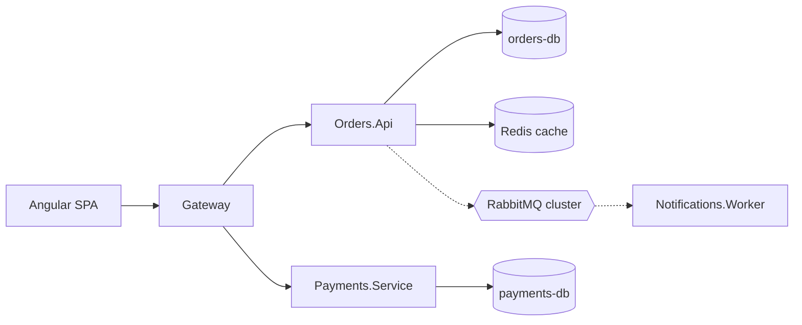

# Ledger platform

Backend for the ledger product. Two services behind the gateway plus a worker.

## Architecture

- `Orders.Api` owns orders and invoices.
- `Payments.Service` owns payments and talks to the card provider.
- Events are published through the outbox (see ADR-0001).
- `Redis cache` fronts the product catalogue.
