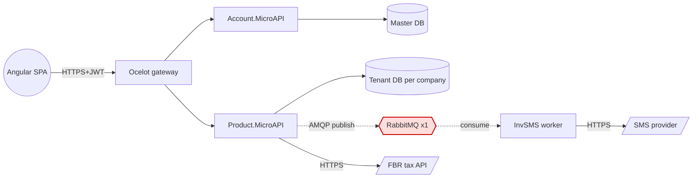
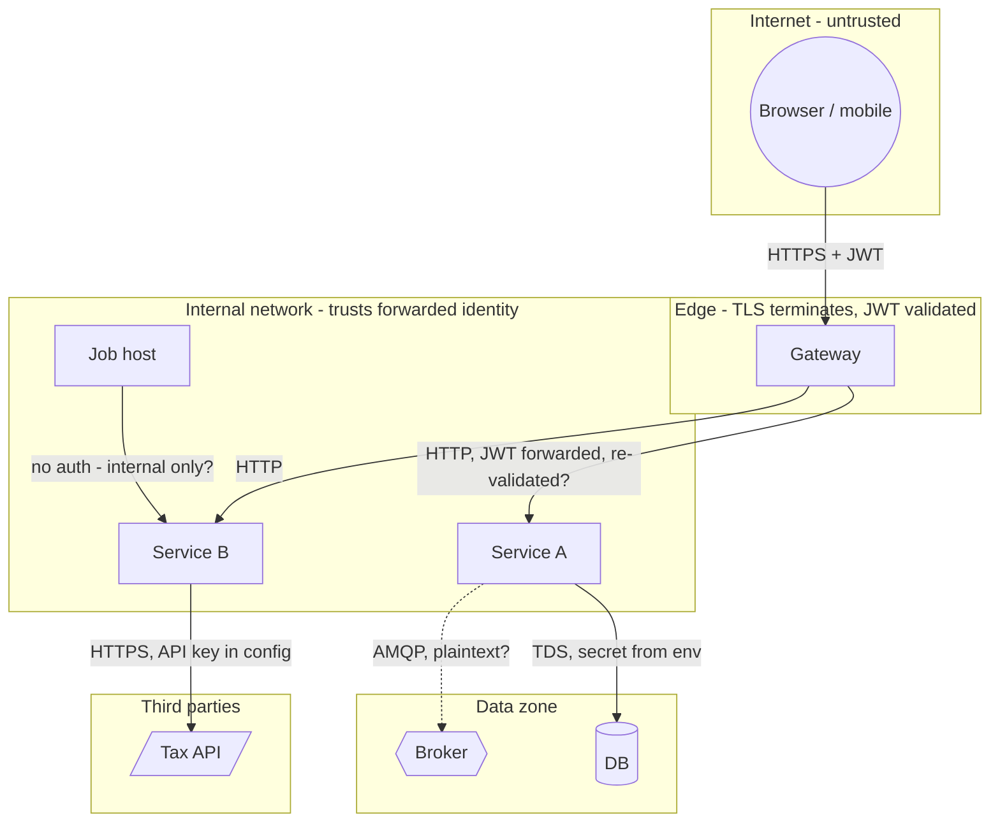
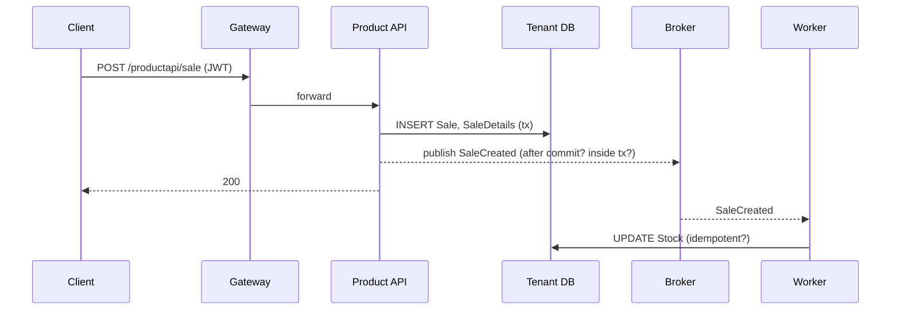
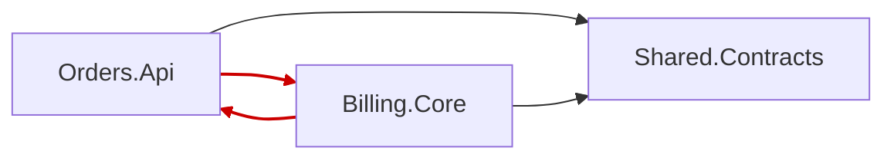

# Diagram templates (Mermaid)

All diagrams in the report are Mermaid text so they render in Markdown and
diff in git. Keep node ids short and stable; put the human name in the label.
Mark single-instance infrastructure with `x1` in the label and style it.

## Conventions
- `[Name]` service/module, `[(Name)]` database, `{{Name}}` queue/broker, `[/Name/]` external system, `((Name))` client.
- Solid arrow `-->` synchronous call; dotted `-.->` asynchronous (publish/consume, webhook); thick `==>` bulk/batch.
- Edge label: protocol and auth (`HTTPS+JWT`, `AMQP`, `TDS`).
- One `subgraph` per deployment/trust zone.
- `classDef spof fill:#fdd,stroke:#c00;` and `class Q spof;` for single points of failure.

## Component / data-flow

## Trust boundaries

Under the diagram, one bullet per boundary crossing: what is checked, what is
trusted without checking, how the secret for that edge is supplied.

## Sequence for the critical flow

Annotate the questions in parentheses; each unanswered one is a trace item.

## Module dependency graph
`scripts/module_graph.py --mermaid` emits this shape; cycles are drawn in red.

## Trust-boundary table (companion to the diagram)
| Edge | From zone | To zone | Transport | Identity carried | Verified at target? | Secret source |
|---|---|---|---|---|---|---|
| SPA -> Gateway | internet | edge | HTTPS | JWT | yes | n/a |
| Gateway -> Product API | edge | internal | HTTP | JWT forwarded | yes (`[Authorize]`) | n/a |
| Product API -> Tenant DB | internal | data | TDS | SQL login | yes | appsettings (finding if literal) |
