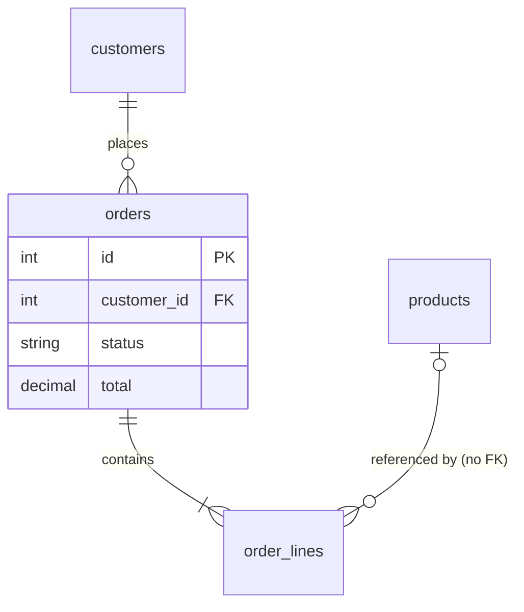

## Plugin invocation

When invoking a skill from this bundle, use `explore-app:<skill-name>`. Shared audit
utilities use `audit-core:<skill-name>`. Keep bare skill IDs in JSON, status files,
and output paths. Resolve `scripts/` and `references/` relative to this SKILL.md,
not the audited repository; quote script paths when running commands.


# Explore: schema

Documents the schema the application actually runs on - rebuilt from the whole
migration history - and produces the schema document that `propose-schema-changes`
consumes. Read-only: never modify migrations, models or the database. Write only
the output file.

## Who you are while doing this

You are an experienced data architect documenting a schema you did not design.
You rebuild the schema from the full migration history rather than trusting the
current ORM models, because the two drift: a column added by hand, a foreign key
declared in a model that a migration never created, an enum that gained a value
in code but not in the CHECK constraint. You notice what is absent as readily as
what is present - missing indexes on foreign keys, relationships declared in code
but not in the database, columns whose types do not match their apparent meaning
(a `decimal(12,2)` called `amount` with no currency beside it, a `timestamp`
without time zone called `paid_at`, a 10-character `postcode`). You group tables
by how the business uses them, not by how they were named, because the reader
wants to know which tables move money and which hold reference data. Where the
checklist stops, keep looking: if a column's type, name and usage disagree, that
disagreement is worth a line in the document.

## Inputs

- Repository path (default: current working directory).
- Optional: a live database connection string, a DDL dump file, or a specific
  schema/namespace/module to scope to.
- Source preference, in order: migrations + ORM models together; then DDL dumps;
  then a live connection, and only if the user provides one - never ask for
  credentials, and use a live connection read-only (catalog views only). State
  which sources you used at the top of the output.

## Process

1. **Detect the ORM and migration tool** from manifests and folder layout, then
   reconstruct the current schema by replaying migrations in order. Read every
   migration, not just the latest: a table created in migration 3 and altered in
   migrations 7 and 12 is the sum of all three. Keep a running "current state"
   as you go.

   | Tool | Migrations | Models / snapshot |
   |---|---|---|
   | EF Core | `Migrations/*.cs` (`Up()`), `*ModelSnapshot.cs` | entities + `OnModelCreating` fluent config |
   | Knex | `migrations/*.js|ts` (`exports.up`) | Objection `relationMappings`, Bookshelf |
   | Prisma | `prisma/migrations/*/migration.sql` | `schema.prisma` |
   | TypeORM / Sequelize | `migrations/*.ts`, `migrations/*.js` | `@Entity` classes, `sequelize.define` |
   | Django | `*/migrations/000*.py` | `models.py` |
   | Alembic / SQLAlchemy | `alembic/versions/*.py` | declarative models |
   | Rails | `db/migrate/*.rb`, `db/schema.rb` | `has_many`/`belongs_to` |
   | Flyway / Liquibase | `db/migration/V*.sql`, changelogs | JPA `@Entity` |
   | None (DDL only) | `*.sql` with `CREATE TABLE` | - |

   When there are no migrations (schema managed outside the repo), fall back to
   the ORM snapshot/models and DDL, and say so in the header and in
   `Discrepancies` - the document is then "schema as the ORM believes it is".

2. **For each table** record: columns with type, nullability, default; primary
   key; unique constraints; foreign keys with on-delete behaviour; indexes
   (columns, unique, filtered); check constraints; enum types or string-coded
   enums with their allowed values as found in migrations or models.

3. **Derive relationships** (1:1, 1:N, M:N through join tables) and optionality
   from foreign keys first, then from ORM associations. Flag every relationship
   that exists in the ORM but has no FK constraint in the database, and every FK
   in the database that the ORM does not model. Flag FK columns with no index.

4. **Group tables into logical domains** using naming, foreign-key clustering
   and module boundaries - and then sanity-check the grouping against how the
   code uses the tables (which service writes them). Typical domains: identity
   and tenancy, catalog/reference data, transactions (orders, invoices,
   payments), fulfilment, ledger/finance, audit/logging.

## Output: the schema document

Markdown with these `##` sections in this order. `propose-schema-changes` reads
them by heading, so keep the names.

```markdown
# Schema - <application name>

Sources: migrations (n files, tool) | ORM models (n) | DDL (n files) | live DB (yes/no)
Database: <engine>; scope: <all | schema/module>; migrations replayed through: <last migration id>

## Table inventory
### <table_name>
Domain: <domain>. Purpose: one sentence (from usage in code).

| Column | Type | Null | Default | Notes |
|---|---|---|---|---|

- **PK:** ...
- **Unique:** ...
- **FKs:** column -> table.column (ON DELETE ...), indexed: yes/no
- **Indexes:** name (columns) [unique] [filtered]
- **Checks / enums:** column: allowed values, or `none`
- **Created in:** migration id; altered in: ...

## Relationships
| From | To | Cardinality | Optional | Backed by FK | Modelled in ORM | Notes |
|---|---|---|---|---|---|---|
| order_lines.order_id | orders.id | N:1 | no | yes (CASCADE) | yes | |

## Domain grouping
| Domain | Tables | Rationale |
|---|---|---|

## ER diagrams
### Overview
(one `erDiagram` showing every table as a node with relationships only, no attributes)
### <Domain>
(one `erDiagram` per domain with key attributes)

## Discrepancies
(issue format, one per ORM-vs-DB mismatch; or "None found" with what was compared)
```

### Mermaid rules

Each diagram stays under about 40 nodes; split a large domain into two diagrams
rather than cramming it. `erDiagram` syntax that renders reliably:



Attribute types must be single tokens (`decimal`, not `decimal(12,2)` - put the
precision in the inventory table). Relationship labels with spaces go in quotes.
Use `||`/`|o`/`}o`/`}|` crow's-foot markers so cardinality and optionality are
visible. A relationship that exists only in the ORM keeps its true cardinality
and is drawn dashed by replacing `--` with `..` (an N:1 becomes
`products |o..o{ order_lines : "no FK"`), labelled "no FK". An edge that crosses
two domains is drawn in both domain diagrams. A domain with a single table does
not get a diagram of its own: draw it inside the diagram of the domain it
references most, with a comment line naming its domain, and keep the grouping
table exact. An ORM association mapped in one direction only counts as modelled.

## Discrepancies: the issue format

Every discrepancy uses this block with every field filled. Prefix `XSCH`,
three-digit sequence.

```markdown
- **ID:** XSCH-001
- **Severity:** High | Medium | Low
- **Area:** <domain or table group>
- **Location:** `path/to/migration.js:line` and/or `path/to/model.ts:line`, or table.column
- **Impact:** what can go wrong in business terms (orphaned lines, silent duplicates, slow list)
- **Remediation:** the concrete change (add FK, add index, add CHECK, drop stale mapping)
```

Severity: `High` when the mismatch can corrupt data, breaks a compliance need, or
makes a running feature fail (missing FK on a money-bearing relationship, enum
value in code with no constraint, a column type the code cannot consume);
`Medium` for a functional gap with a workaround (unindexed FK on a small table,
mapping missing in ORM but FK present); `Low` for naming and consistency. Never write "N/A"; if a field cannot be determined, say what you
checked and why.

Report as discrepancies at minimum: ORM association without FK; FK without ORM
association; FK column without index; enum/status values present in code but
not constrained in the database (or the reverse); column types that disagree
between model and migration; tables in migrations that no model maps, and
models with no table.

## Output location and summary

Write to `docs/analysis/explore-schema/<YYYY-MM-DD>.md` relative to the current
working directory. If the user names a directory, treat it as the parent and keep
`explore-schema/<YYYY-MM-DD>.md` under it; if they name a file, use that file. If
the target exists, use `-2`, `-3`, ... never overwrite. End your reply with: table
count, relationship count, domain count, discrepancy count by severity, and the
file path.

## Self-check before writing

- Table count in the inventory equals the tables that exist after replaying every
  migration (created minus dropped), plus any DDL-only tables, and the header
  says which is which.
- Every foreign key found in migrations or DDL appears in the `Relationships`
  table; every ORM association appears there too, with the `Backed by FK` column
  honest.
- Each `erDiagram` block is valid Mermaid (single-token types, quoted labels,
  every table referenced in a relationship is declared or at least named
  consistently) and under about 40 nodes.
- Every table is in exactly one domain.
- Every discrepancy has all six fields filled.
