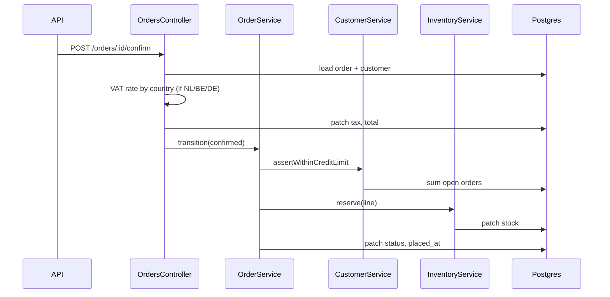
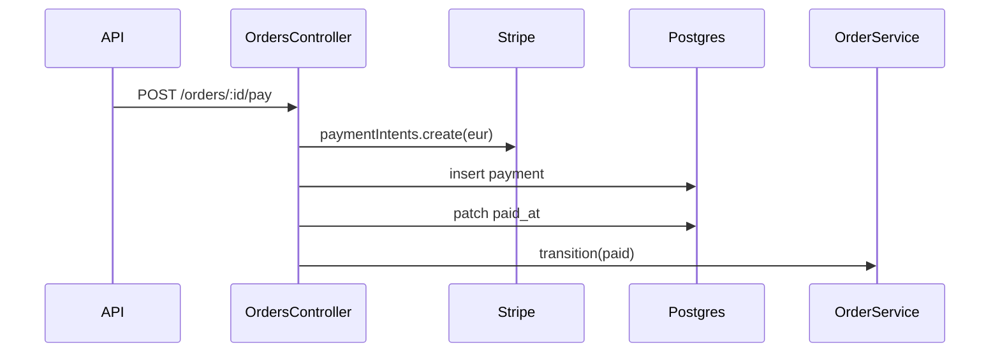
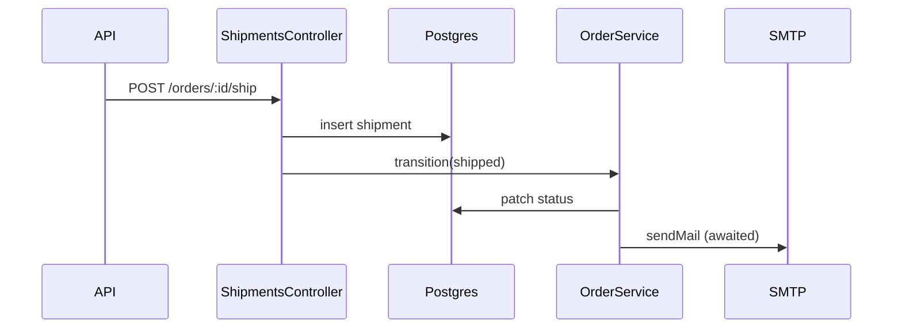
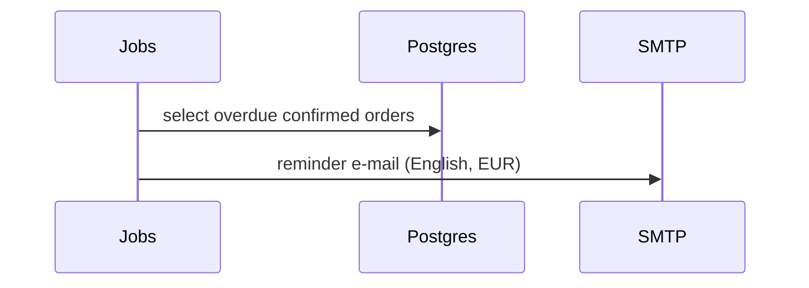
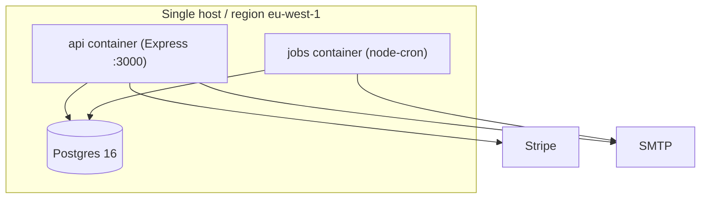
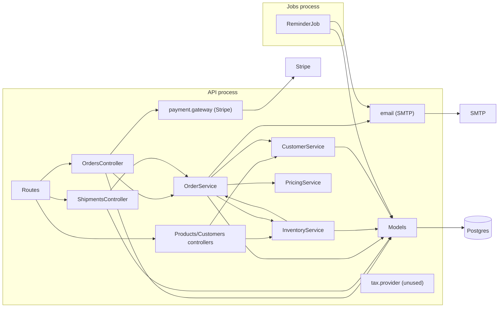

# Architecture - Orderly

Source: sample-repo @ 2026-09-10; scope: all; stack: TypeScript / Express 4 / Objection+Knex / PostgreSQL 16 / node-cron / Stripe SDK / nodemailer
Layout: monolith with a separate jobs process; deployable units: 2 (api, jobs) + Postgres
Documented vs built: README claims "services never import each other" and "business rules live exclusively in services"; the code has a service-to-service cycle and tax rules in a controller. Generated by explore-architecture.

## Overview
A single Express application exposes order, catalog and customer endpoints behind one shared API key. Controllers call services, which use Objection models directly. A second process runs a daily cron job that queries the models directly and sends e-mails. Stripe and SMTP are called from application code with no abstraction layer. One Postgres database, one region, one time zone.

## Layer and module map
Layer rule as observed: routes -> controllers -> services -> models; integrations callable from services; jobs -> models.
| Module | Layer | Responsibility | Depends on | Depended on by |
|---|---|---|---|---|
| src/routes | routing | maps URLs to controller functions | controllers | app |
| src/controllers | controllers | request parsing, response shaping; also tax calculation, payment orchestration and shipment creation | services, models, validators, integrations/payment.gateway | routes |
| src/services | services | order lifecycle, credit check, stock, pricing | models, integrations/email, services (cycle) | controllers, jobs (none - jobs bypass services) |
| src/models | models | Objection models and relation mappings | - | controllers, services, jobs |
| src/validators | validation | zod input schemas | - | controllers |
| src/integrations | integrations | Stripe charge, VAT lookup (dead), SMTP | - | controllers (payment), services (email) |
| src/jobs | jobs | reminder cron | models, integrations/email | - |
| src/middleware | cross-cutting | API-key check | - | app |

## Runtime components
| Component | Kind | Technology | Owned by module | Notes |
|---|---|---|---|---|
| API | api | Express on :3000 | src/app.ts | single process |
| Jobs | scheduler | node-cron in a second container | src/jobs | shares DB; server-time cron |
| Postgres | db | PostgreSQL 16, one database | knexfile.js | eu-west-1 only |
| Stripe | external | Stripe SDK | src/integrations/payment.gateway.ts | called from orders.controller; currency 'eur' hard-coded |
| SMTP | external | nodemailer | src/integrations/email.ts | English templates inline |

## Dependency analysis
Import graph (module level): routes -> controllers -> {services, models, validators, integrations}; services -> {models, integrations, services}; jobs -> {models, integrations}.

- **ID:** XARC-001
- **Severity:** Medium
- **Area:** services
- **Location:** `src/services/inventory.service.ts:2` -> `src/services/order.service.ts`; `src/services/order.service.ts:3` -> `src/services/inventory.service.ts`
- **Impact:** OrderService and InventoryService cannot be tested or extracted separately; the low-stock report depends on order internals.
- **Remediation:** move `countOpenForProduct` to a query used by both, or have the controller compose the two services.

- **ID:** XARC-002
- **Severity:** High
- **Area:** controllers
- **Location:** `src/controllers/orders.controller.ts:6` -> `src/integrations/payment.gateway.ts`; `orders.controller.ts:20-25` (tax); `shipments.controller.ts:14-21` (shipment insert + transition)
- **Impact:** controllers hold business rules (tax rates, payment sequencing, shipping) that services do not know about; the reminder job and any future channel (import, API v2) will bypass them.
- **Remediation:** move tax, payment and shipping orchestration into services; controllers only parse and respond.

- **ID:** XARC-003
- **Severity:** Medium
- **Area:** jobs
- **Location:** `src/jobs/reminder.job.ts:11-14` -> `src/models/order.model.ts`
- **Impact:** the job re-implements the "open unpaid order" rule with a different definition from `customer.service.ts:27`.
- **Remediation:** route the job through the service layer or a shared query.

## Representative flows
### Confirm order
`POST /orders/:id/confirm` -> orders.controller.confirm (loads order+customer; computes VAT from a country conditional; patches tax/total) -> OrderService.transition('confirmed') -> CustomerService.assertWithinCreditLimit -> InventoryService.reserve per line -> Order patch.

### Pay order
`POST /orders/:id/pay` -> orders.controller.pay (status pre-check) -> Stripe charge (EUR) -> Payment insert -> Order patch paid_at -> OrderService.transition('paid').

### Ship order
`POST /orders/:id/ship` -> shipments.controller.ship (status pre-check; Shipment insert) -> OrderService.transition('shipped') -> sendEmail (SMTP, synchronous) -> response.

### Reminder job
cron 09:00 server time -> reminder.job queries orders (confirmed, unpaid, placed_at < now-7d) with customer -> sendEmail per order.

## Deployment topology
docker-compose: `api` and `jobs` containers built from the same image, one `db` (Postgres 16) with a local volume. Environment: DATABASE_URL, STRIPE_KEY, SMTP_URL, TZ=Europe/Amsterdam, API_KEY. README states eu-west-1. No Kubernetes, no Terraform, no CI config found.

## Cross-cutting concerns
| Concern | Mechanism | Location | Observations |
|---|---|---|---|
| Authentication | single shared API key header | src/middleware/auth.ts:5 | no users |
| Authorization | none | not found (searched controllers, middleware) | every caller can do everything |
| Configuration | environment variables | knexfile.js, docker-compose.yml | no per-tenant or per-market config |
| Logging | console.error in global handler | src/app.ts:16 | no correlation id, no structured logs |
| Error handling | one Express error middleware | src/app.ts:16-19 | integration failures surface as 500 |
| i18n/l10n | none | not found (strings inline in services/jobs) | English literals; EUR literals |
| Time zones | container TZ + naive timestamps | docker-compose.yml, migrations | cron in server time |
| Multi-tenancy | none | not found | single customer base, single DB |
| Data residency / region | single region | README, docker-compose | no mechanism to place data elsewhere |

## Diagrams
### Component diagram

### Deployment diagram
(see Deployment topology)
