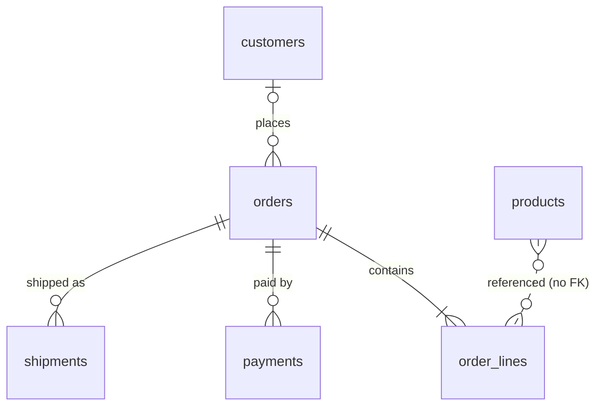

# Schema - Orderly

Sources: migrations (5 files, Knex) | ORM models (6, Objection) | DDL (0) | live DB (no)
Database: PostgreSQL 16; scope: all; migrations replayed through: 20260301000000_add_shipments. Generated by explore-schema on 2026-09-10.

## Table inventory
### customers
Domain: Customers. Purpose: trade customers that order on credit.

| Column | Type | Null | Default | Notes |
|---|---|---|---|---|
| id | serial | no | | |
| name | varchar(200) | no | | |
| email | varchar(254) | no | | no unique constraint |
| phone | varchar(20) | yes | | |
| address_line1 | varchar(200) | yes | | |
| city | varchar(100) | yes | | |
| postcode | varchar(10) | yes | | |
| country | char(2) | no | 'NL' | |
| credit_limit | decimal(12,2) | no | 0 | no currency column |
| created_at | timestamp | no | now() | without time zone |

- **PK:** id
- **Unique:** none
- **FKs:** none
- **Indexes:** none besides PK
- **Checks / enums:** none
- **Created in:** 20260101000000_create_customers

### products
Domain: Catalog. Purpose: sellable items with on-hand stock.

| Column | Type | Null | Default | Notes |
|---|---|---|---|---|
| id | serial | no | | |
| sku | varchar(64) | no | | |
| name | varchar(200) | no | | single language |
| unit_price | decimal(12,2) | no | | no currency column |
| stock_on_hand | integer | no | 0 | no check >= 0 |
| reorder_level | integer | no | 0 | added 20260301 |
| is_active | boolean | no | true | |
| created_at | timestamp | no | now() | without time zone |

- **PK:** id
- **Unique:** (sku) - global, not per legal entity
- **FKs:** none
- **Indexes:** products_sku_unique
- **Checks / enums:** none
- **Created in:** 20260102000000_create_products; altered in: 20260301000000_add_shipments

### orders
Domain: Orders. Purpose: customer purchases.

| Column | Type | Null | Default | Notes |
|---|---|---|---|---|
| id | serial | no | | |
| customer_id | integer | yes | | FK to customers; nullable |
| order_no | varchar(32) | no | | not unique |
| status | varchar(20) | no | 'draft' | free text; code uses draft, confirmed, paid, shipped, delivered, cancelled |
| subtotal | decimal(12,2) | no | 0 | |
| tax | decimal(12,2) | no | 0 | no rate stored |
| total | decimal(12,2) | no | 0 | |
| placed_at | timestamp | yes | | without time zone |
| paid_at | timestamp | yes | | added 20260201 |
| created_at | timestamp | no | now() | without time zone |

- **PK:** id
- **Unique:** none
- **FKs:** customer_id -> customers.id (NO ACTION), indexed: yes
- **Indexes:** orders_customer_id_index
- **Checks / enums:** none
- **Created in:** 20260103000000_create_orders; altered in: 20260201000000_add_payments

### order_lines
Domain: Orders. Purpose: products on an order.

| Column | Type | Null | Default | Notes |
|---|---|---|---|---|
| id | serial | no | | |
| order_id | integer | no | | FK CASCADE |
| product_id | integer | no | | no FK |
| qty | integer | no | | no check > 0 |
| unit_price | decimal(12,2) | no | | |
| line_total | decimal(12,2) | no | | |

- **PK:** id
- **Unique:** none
- **FKs:** order_id -> orders.id (CASCADE), indexed: no
- **Indexes:** none
- **Checks / enums:** none
- **Created in:** 20260103000000_create_orders

### payments
Domain: Payments. Purpose: card charge attempts.

| Column | Type | Null | Default | Notes |
|---|---|---|---|---|
| id | serial | no | | |
| order_id | integer | no | | FK |
| provider_ref | varchar(100) | yes | | no provider column |
| amount | decimal(12,2) | no | | no currency column |
| status | varchar(20) | no | 'pending' | code uses pending, succeeded, failed |
| paid_at | timestamp | yes | | without time zone |
| created_at | timestamp | no | now() | |

- **PK:** id
- **Unique:** none
- **FKs:** order_id -> orders.id (NO ACTION), indexed: no
- **Indexes:** none
- **Checks / enums:** none
- **Created in:** 20260201000000_add_payments

### shipments
Domain: Fulfilment. Purpose: carrier consignments.

| Column | Type | Null | Default | Notes |
|---|---|---|---|---|
| id | serial | no | | |
| order_id | integer | no | | FK |
| carrier | varchar(50) | no | | |
| tracking_no | varchar(64) | yes | | |
| weight_kg | decimal(8,3) | yes | | unit fixed in column name |
| shipped_at | timestamp | yes | | without time zone |
| delivered_at | timestamp | yes | | without time zone |

- **PK:** id
- **Unique:** none
- **FKs:** order_id -> orders.id (NO ACTION), indexed: yes
- **Indexes:** shipments_order_id_index
- **Checks / enums:** none
- **Created in:** 20260301000000_add_shipments

## Relationships
| From | To | Cardinality | Optional | Backed by FK | Modelled in ORM | Notes |
|---|---|---|---|---|---|---|
| orders.customer_id | customers.id | N:1 | yes (nullable) | yes | yes | |
| order_lines.order_id | orders.id | N:1 | no | yes (CASCADE) | yes | FK not indexed |
| order_lines.product_id | products.id | N:1 | no | no | yes | ORM relation only |
| payments.order_id | orders.id | N:1 | no | yes | yes | FK not indexed |
| shipments.order_id | orders.id | N:1 | no | yes | no | no ORM relation |

## Domain grouping
| Domain | Tables | Rationale |
|---|---|---|
| Customers | customers | identity and credit |
| Catalog | products | reference data |
| Orders | orders, order_lines | transactional core |
| Payments | payments | money in |
| Fulfilment | shipments | goods out |

## ER diagrams
### Overview

## Discrepancies
- **ID:** XSCH-001
- **Severity:** High
- **Area:** Orders
- **Location:** `src/models/order.model.ts:17` vs `migrations/20260103000000_create_orders.js:17`
- **Impact:** order lines can reference deleted or non-existent products; stock and revenue reports by product become unreliable.
- **Remediation:** add FK order_lines.product_id -> products.id (RESTRICT) and an index.

- **ID:** XSCH-002
- **Severity:** Medium
- **Area:** Fulfilment
- **Location:** `migrations/20260301000000_add_shipments.js:5` vs `src/models/shipment.model.ts`
- **Impact:** FK exists but no ORM relation; code loads shipments by manual query and cannot eager-load.
- **Remediation:** add `order` relation mapping to Shipment model.
